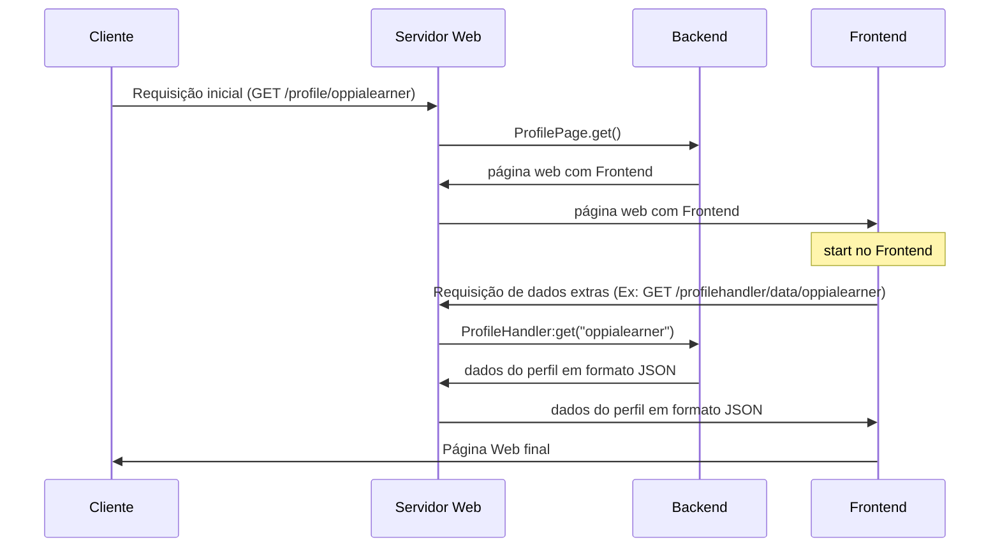
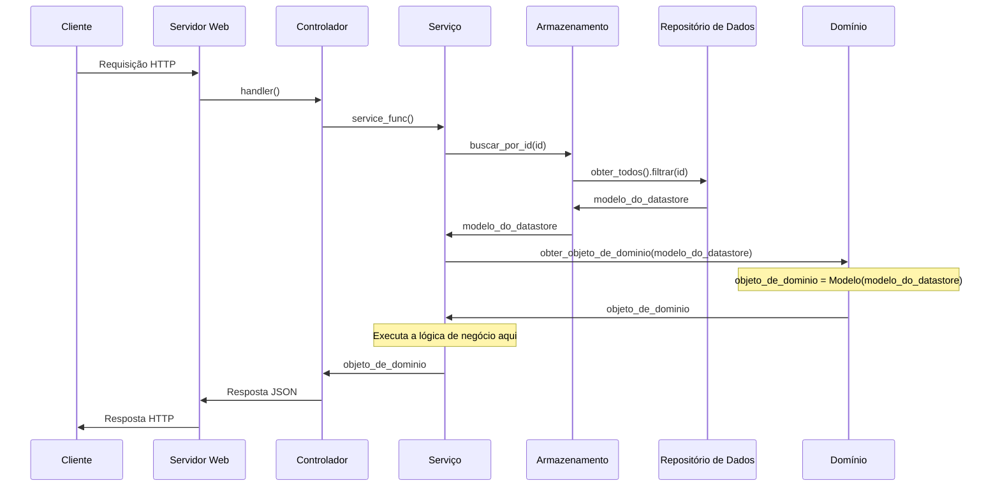
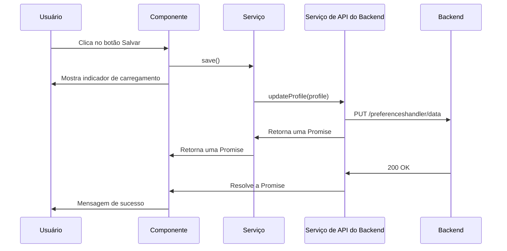
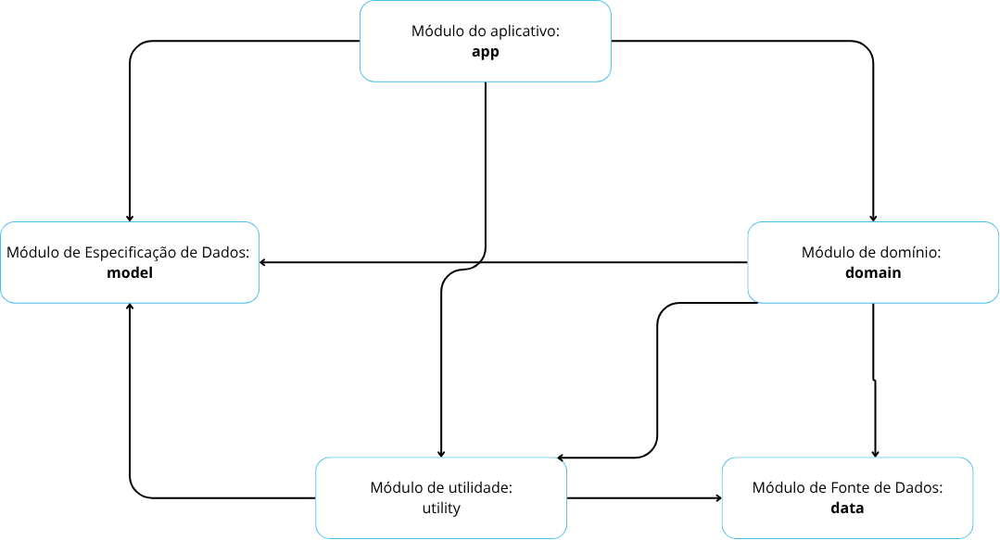

# 3. Descrição do Produto de Software

O Oppia é uma plataforma educacional interativa de código aberto, voltada para estudantes, professores e criadores de conteúdo. Seu objetivo principal é facilitar o aprendizado ativo e personalizado por meio de lições interativas chamadas “explorações”, que se adaptam às respostas e ao ritmo de cada usuário.

O sistema permite também que usuários criem conteúdo educacional, adicionando perguntas, explicações e multimídia, tornando-o uma ferramenta tanto de consumo quanto de produção de conhecimento. O Oppia funciona em navegadores web e em aplicativo Android, permitindo acesso online e offline.

A seguir, apresenta-se uma descrição detalhada do produto, organizada em tabela, abrangendo tipo, funcionalidades, usuários, ambiente de uso e outros aspectos relevantes para a avaliação de qualidade do software:

 Tabela 1 - Descrição Detalhada do Produto Oppia </a> 

| Item | Descrição |
|------|-----------|
| Nome | Oppia |
| Tipo | Plataforma educacional interativa (Web e Mobile), código aberto, disponível para múltiplos usuários e sem fins lucrativos|
| Repositório | [https://github.com/oppia/oppia](https://github.com/oppia/oppia) |
| Backend | Python (Django) |
| Banco de Dados | MariaDB / MySQL |
| Plataforma | Navegadores web (desktop e mobile), App Android |
| Público-alvo | Estudantes, professores/educadores e voluntários criadores de conteúdo educacional |
| Principais funções | 1. Navegar e acessar explorações 2. Responder perguntas interativas e receber feedback 3. Criar e editar explorações 4. Gerenciar conta, objetivos e progresso do usuário 5. Visualizar estatísticas de desempenho |
| Principais tarefas | Aprendizado interativo e personalizado;   Criação e publicação de conteúdo educativo;   Monitoramento do progresso do aluno |
| Janelas de interação | Login/cadastro;   Dashboard do usuário; Tela de exploração;   Editor de explorações;   Visualização de estatísticas |
| Ambiente de uso | Escolas, cursos online e ambientes de aprendizagem individuais;   Acesso via internet (web) ou app móvel (Android) |
| Nível de conhecimento em informática | Básico a intermediário (navegação e uso do app) |
| Nível de conhecimento no domínio | Não é necessário conhecimento técnico; |
| Componentes para avaliação | Interface de exploração; editor de autoria; gestão de usuários e progresso |
| Massa de dados disponível | Explorações dpúblicas e conteúdo educacional já existentes na plataforma |
| Requisitos de hardware/software | Navegador moderno ou Android 7.0+;   Conexão com internet (uso offline via app disponível)

<b>Fonte: </b>Autoria de <a href="https://github.com/bolzanMGB">Othavio Bolzan</a>

## 3.1 Classificação do Tipo de Produto

A classificação de produtos de software é importante para entender seu escopo, forma de distribuição e complexidade, além de auxiliar na definição dos critérios de avaliação de qualidade.
Existem diversas formas de classificar software, considerando domínio de aplicação, modelo de negócio, características construtivas e disponibilidade de dados.

Entre as classificações mais conhecidas estão:

* **Pressman (2002):** define categorias como software básico, comercial, científico/engenharia, embarcado, de computador pessoal e inteligência artificial.

* **IEEE 1062 (1998):** classifica produtos em COTS (Commercial Off-The-Shelf), MOTS (Modified Off-The-Shelf) e CUSTOMIZADO/FD (Fully Developed), considerando o nível de customização, manutenção, prazo de entrega e adequação ao uso do software.

* **Categorias práticas:** utilizadas em premiações ou avaliações, como educação, saúde, varejo, indústria, entre outras, destacando o domínio de aplicação do software.

A seguir, apresentamos a classificação do Oppia segundo essas abordagens:

 Tabela 2 - Classificação do Produto Oppia </a> 

| Critério                 | Classificação                                | Justificativa                                                                                                                                                                                        |
| ------------------------ | -------------------------------------------- | ---------------------------------------------------------------------------------------------------------------------------------------------------------------------------------------------------- |
| Segundo Pressman (2002)  | **Software Comercial**                       | Produto padronizado e completo, disponível para um público amplo, com funcionalidades definidas; mesmo sendo de organização sem fins lucrativos, sua natureza funcional se enquadra nesta categoria. |
| Segundo IEEE 1062 (1998) | **COTS (Commercial Off-The-Shelf Software)** | Produto pronto, utilizado por diversos usuários, sem desenvolvimento específico para Clientee; avaliação pode ser feita com critérios gerais de qualidade.                                            |
| Categoria prática        | **Educação e entretenimento**                | Plataforma voltada à disseminação de conhecimento e criação de conteúdo educativo interativo; público-alvo: estudantes, professores e criadores de conteúdo.                                         |

<b>Fonte: </b>Autoria de <a href="https://github.com/bolzanMGB">Othavio Bolzan</a>

## 3.2 Estrutura do Software

A arquitetura de um software define seus componentes fundamentais e como eles interagem, sendo o projeto crucial para a longevidade e manutenibilidade de um sistema. O objetivo principal de uma boa arquitetura é gerenciar a complexidade e minimizar o custo de vida do sistema, facilitando modificações e adições futuras através da separação de interesses [^5]. Geralmente, isso é alcançado separando as responsabilidades em camadas distintas, como a interface com o usuário (frontend), a lógica de negócios (backend) e o armazenamento de dados.

A plataforma educacional Oppia é um excelente exemplo dessa engenharia estruturada. Ela foi projetada para ser uma ferramenta poderosa e acessível, o que exigiu a criação de duas arquiteturas distintas, mas complementares: uma plataforma web completa e um aplicativo Android nativo, cada uma com tecnologias e padrões específicos para atender às suas finalidades [^3].

### Módulos Principais do Oppia

O ecossistema Oppia é organizado em torno do conceito de "Explorações" equivalentes à lições interativas que guiam os alunos por um caminho de aprendizado. A plataforma web, que é o coração do sistema, é composta por vários módulos principais, como o núcleo que gerencia a lógica das lições, um módulo de extensões para interações ricas, o backend que processa a lógica de negócios e um conjunto de scripts para gerenciamento de dados e tarefas em segundo plano [^3].

### Interfaces (Desktop e Mobile)

A Oppia atinge seus usuários por meio de duas interfaces principais, cada uma projetada para um contexto de uso diferente:

* **Interface Web (Desktop):** É a plataforma principal, acessada por um navegador, que oferece a experiência completa do Oppia, incluindo a criação de conteúdo por educadores. É a interface ideal para usuários com acesso estável à internet [^3].
* **Interface Mobile (Android):** É um aplicativo nativo projetado com uma abordagem "offline-first", visando tornar o aprendizado acessível em áreas com conectividade limitada. O aplicativo permite baixar lições e sincronizar o progresso posteriormente, com uma arquitetura otimizada para o desempenho em dispositivos móveis [^4].

### Plataforma Web

A plataforma web utiliza **Python** sobre o **Google App Engine (GAE)** para o backend, **AngularJS** e **TypeScript** para o frontend, e **Google Cloud Datastore** como banco de dados NoSQL. A arquitetura se baseia em **MVC (Model-View-Controller)** Para a funcionalidade de busca, o sistema emprega **Elasticsearch**, enquanto tarefas assíncronas são gerenciadas pelo **Google Cloud Tasks** [^3].

### Fluxo de Requisição do Perfil (Servidor Web)
O processo de carregamento da página ocorre em duas etapas principais:

Primeiramente, o cliente (seu navegador) faz uma requisição inicial ao Servidor Web para carregar a estrutura da página. O servidor aciona o Backend, que devolve a página web contendo o código Frontend.
Assim que esse código começa a rodar no navegador, o Frontend faz uma segunda requisição ao Servidor Web, mas desta vez para buscar dados específicos (como informações de um perfil). O Backend responde a essa nova chamada enviando apenas os dados brutos, em formato JSON.

Finalmente, o Frontend utiliza esses dados JSON para montar a página final e exibi-la de forma completa para o cliente. Abaixo é possivel visualizar o diagrama 01 que mostra o fluxo de dados desde o Cliente passando pelo servidor web, o backend e o frontend.

 Diagrama 01 - Anatomia do Servidor Web</a> 

<b>Fonte:  </b> <a href="https://github.com/oppia/oppia/wiki/Overview-of-the-Oppia-codebase">OPPIA</a>

### Backend

 Diagrama 02 - Backend Web</a> 

<b>Fonte:  </b> <a href="https://github.com/oppia/oppia/wiki/Overview-of-the-Oppia-codebase">OPPIA</a>

O diagrama 02 acima ilustra as camadas que compõem a arquitetura do backend do Oppia. Neste fluxo, o "Cliente" pode ser o código frontend rodando no navegador do usuário ou qualquer outro sistema que consuma a API. O processo começa quando o Cliente envia uma Requisição HTTP ao Servidor Web.

O servidor, por sua vez, encaminha essa requisição para a camada de Controlador, que atua como o ponto de entrada. O controlador invoca um Serviço para executar a lógica de negócio. O serviço, então, interage com a camada de Armazenamento para buscar os dados necessários. A camada de armazenamento consulta o Repositório de Dados (como o Google Cloud Datastore), que retorna um modelo de dados bruto.

Esse modelo é repassado de volta ao Serviço, que o utiliza para criar um Objeto de Domínio — uma representação mais rica e estruturada dos dados, contendo a lógica de negócio. Com o objeto de domínio em mãos, o serviço executa as operações necessárias e retorna o resultado ao Controlador.

Finalmente, o controlador formata a resposta (geralmente em JSON) e a envia ao Servidor Web, que a entrega como uma Resposta HTTP ao cliente original, completando o ciclo.

### Frontend

 Diagrama 03 - Frontend Web</a> 

<b>Fonte:  </b> <a href="https://github.com/oppia/oppia/wiki/Overview-of-the-Oppia-codebase">OPPIA</a>

O diagrama descreve um fluxo comum na arquitetura frontend, como salvar as preferências de um usuário. O Usuário interage com um Componente (a interface visual), que, ao receber uma ação, exibe um feedback visual (indicador de carregamento) e aciona um Serviço para lidar com a lógica.

O serviço, por sua vez, utiliza um Serviço de API do Backend para se comunicar com o servidor. Este serviço especializado envia uma requisição HTTP (neste caso, PUT) para o Backend. A comunicação é assíncrona, utilizando Promises para gerenciar a resposta. Quando o backend confirma o sucesso da operação, a Promise é resolvida, o Componente é notificado e, finalmente, exibe uma mensagem de sucesso para o Usuário.

### Aplicativo Android

O aplicativo Android é desenvolvido em **Kotlin**, combinando elementos das arquiteturas **MVP (Model-View-Presenter), MVC (Model-View-Controller) e MVVM (Model-View-ViewModel)** e princípios de **Clean Architecture**. Ele utiliza **Room** como banco de dados local para a funcionalidade offline, **Dagger** e **Hilt** para injeção de dependência e **Kotlin Coroutines** para programação assíncrona. O conjunto de testes é baseado em **JUnit**, **Espresso** e **Robolectric** [^4].

Abaixo na Figura 01 é mostrado como a estrutura de diretorio funciona na versão mobile do aplicativo, e logo abaixo uma explicação de cada módulo exemplificado.

 Figura 01 - Estrutura de Diretórios. </a> 

<b>Fonte:  </b> <a href="https://github.com/oppia/oppia-android/blob/develop/wiki/Overview-of-the-Oppia-Android-codebase-and-architecture.md">OPPIA</a>

#### 1. Módulo `app`
Este é o **módulo principal da aplicação**, contendo todos os componentes de **interface com o usuário (UI)**. Ele abriga as `Activities`, `Fragments`, `ViewModels` e `Presenters` que compõem as telas do aplicativo. É aqui também que se encontram os testes de interface e integração.
* **Exemplos:** A pasta `app/player` contém toda a lógica do player de lições, enquanto `app/topic` e `app/story` gerenciam as telas de Tópicos e Histórias, respectivamente.

####  2. Módulo `data`
Responsável por **fornecer dados para a aplicação**. Ele faz a ponte entre o aplicativo e as fontes de dados, seja buscando informações do backend do Oppia ou gerenciando o armazenamento para uso offline.
* **Exemplos:** A subpasta `data/backends` contém as APIs para requisitar dados do servidor, e `data/persistence` oferece suporte ao cache para persistência de dados offline.

####  3. Módulo `domain`
Contém a **lógica de negócio** ("business logic") da aplicação. Este módulo é uma biblioteca pura em Java/Kotlin, sem dependências de componentes Android, o que significa que ele lida com regras e controladores centrais de forma independente da interface.
* **Exemplos:** `domain/classify` é responsável por classificar as respostas dos usuários, `domain/profile` gerencia a criação e atualização de perfis, e `domain/exploration` controla a lógica de como uma lição é carregada e reproduzida.

####  4. Módulo `model`
Esta biblioteca contém exclusivamente as **estruturas de dados** (`protos`) usadas em todo o aplicativo. Sua única função é definir os modelos de dados, sem conter qualquer lógica de programação.

####  5. Módulo `utility`
Como o nome sugere, este módulo fornece **utilitários e ferramentas reutilizáveis** que podem ser usados por qualquer outro módulo. Também é uma biblioteca Java/Kotlin sem dependências diretas do Android.
* **Exemplos:** Inclui ferramentas para verificar o status da conexão (`utility/networking`), analisar textos com formatação especial (`utility/parser`) e um sistema de `Logger` customizado para o projeto (`utility/logging`).

#### 6. Módulo `testing`
Este módulo não faz parte da aplicação final, mas contém **classes e utilitários auxiliares** que facilitam a escrita de testes para os outros módulos, garantindo a qualidade e o bom funcionamento do código.

***

Esta é uma visão geral da estrutura. Para uma lista completa e detalhada de todas as funcionalidades e subpastas de cada módulo, **é recomendado consultar a documentação oficial do projeto**.                                                                                                          |

---

### Referências
[^1]: RAMOS, Cristiane Soares. Processo de Avaliação de
Produto de Software. 2025. Disponível em: https://aprender3.unb.br/pluginfile.php/3230274/mod_resource/content/1/2025-2%20PROC%20AVAL%20PRODUTO.pdf.Acesso em: 29 set. 2025.

[^2]: Guerra, Ana Cervigni; Colombo, Regina Maria Thienne. Qualidade de produto de software. Disponível em: https://www.academia.edu/8349754/Qualidade_de_Produto_de_Software.Acesso em: 29 set. 2025.

[^3]: OPPIA. Overview of the Oppia codebase. [S. l.]: GitHub, 2023. Disponível em: https://github.com/oppia/oppia/wiki/Overview-of-the-Oppia-codebase em: 01 out. 2025.

[^4]: OPPIA. Overview of the Oppia Android codebase and architecture. [S. l.]: GitHub, 2024. Disponível em: https://github.com/oppia/oppia-android/blob/develop/wiki/Overview-of-the-Oppia-Android-codebase-and-architecture.md. Acesso em: 1 out. 2025.

[^5]: MARTIN, Robert C. Arquitetura Limpa: O Guia do Artesão para Estrutura e Design de Software. Rio de Janeiro: Alta Books, 2019.

---

### Histórico de Versão

| Versão | Data       | Descrição                                                   | Autor                                               | Revisor                                                                                                        |
| :----: | ---------- | ----------------------------------------------------------- | --------------------------------------------------- | -------------------------------------------------------------------------------------------------------------- |
| `1.0`  | 28/09/2025 | Criação da estrutura do Documento                           | [Brunno Fernandes](https://github.com/brunnoff)     | [Othavio Bolzan](https://github.com/bolzanMGB)                                                                 |
| `1.1`  | 29/09/2025 | Elaboração da Descrição  e Classificação do Tipo de Produto | [Othavio Bolzan](https://github.com/bolzanMGB)      | [Brunno Fernandes](https://github.com/brunnoff)                                                                |
| `1.2`  | 29/09/2025 | Padronização de tópicos e Referências                       | [Douglas Marinho](https://github.com/M4RINH0)       | [Brunno Fernandes](https://github.com/brunnoff) &&   [Bianca Patrocínio](https://github.com/BiancaPatrocinio7) |
| `1.3`  | 01/10/2025 | Criação do tópico 3.2 e adição das referências 3,4,5        | [Pedro Lucas Dourado](https://github.com/lucasdray) | [Brunno Fernandes](https://github.com/brunnoff)   