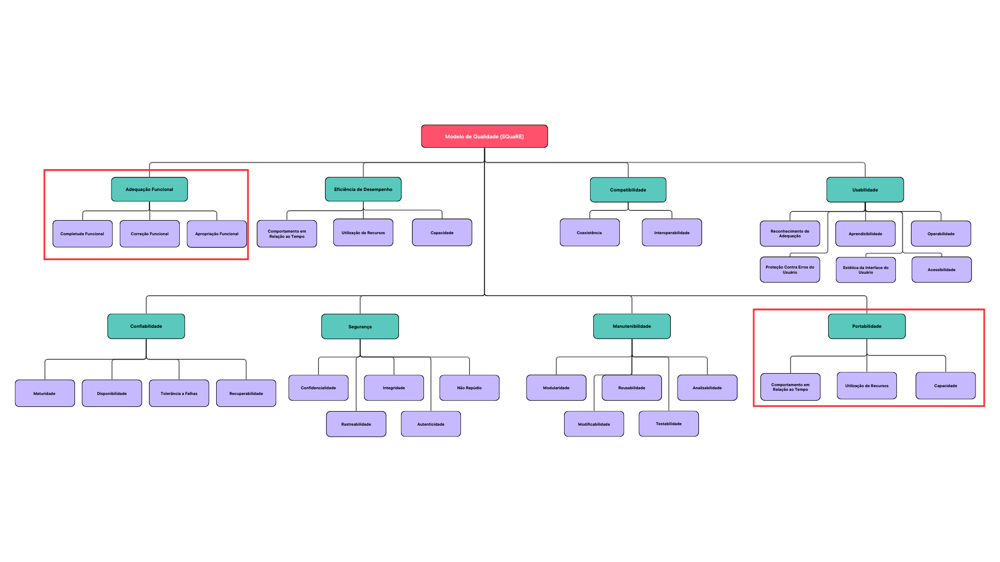

# 4. Modelo de Qualidade

## 4.1 Introdução

Este documento estabelece o Modelo de Qualidade de Produto de Software que será utilizado como referência para o desenvolvimento e avaliação da Plataforma Oppia. Baseado na norma **ISO/IEC 25010 (SQuaRE — *Software product Quality Requirements and Evaluation*)**, este artefato define as características e subcaracterísticas de qualidade que são prioritárias para o projeto.

Considerando os artefatos anteriores, que definem o propósito do software, as partes interessadas e a descrição da arquitetura do produto, a seleção das características de qualidade aqui apresentadas visa garantir que o resultado final atenda aos objetivos estratégicos e às necessidades dos usuários.

## 4.2 Objetivo

O objetivo deste artefato é formalizar um framework de qualidade claro e objetivo, que servirá para:

* **Definir** critérios de aceitação mensuráveis para o produto de software.
* **Orientar** as equipes de desenvolvimento, testes e validação na melhora continua de um produto alinhado às expectativas de qualidade.
* **Servir** como base para a verificação e validação do software ao longo de seu ciclo de vida.
* **Comunicar** de forma transparente às partes interessadas quais aspectos de qualidade estão sendo priorizados e por que estão sendo priorizados.

## 4.3 Modelo de Qualidade (SQuaRE)

O modelo SQuaRE, especificado na norma ISO/IEC 25010 [^1], define oito características que descrevem a qualidade de um produto de software. Essas características são detalhadas na tabela abaixo:

  
<strong>Tabela 1:</strong> Descrição das Características de Qualidade

  <table>
    <thead>
      <tr>
        <th style="text-align: left;">Característica</th>
        <th style="text-align: left;">Descrição (resumida da ISO/IEC 25010)</th>
      </tr>
    </thead>
    <tbody>
      <tr>
        <td style="text-align: left;"><strong>Adequação Funcional</strong></td>
        <td style="text-align: left;">Grau em que o produto fornece funções que atendem às necessidades declaradas e implícitas quando usado sob condições especificadas.</td>
      </tr>
      <tr>
        <td style="text-align: left;"><strong>Eficiência de Desempenho</strong></td>
        <td style="text-align: left;">Desempenho relativo à quantidade de recursos usados sob condições estabelecidas.</td>
      </tr>
      <tr>
        <td style="text-align: left;"><strong>Compatibilidade</strong></td>
        <td style="text-align: left;">Grau em que um produto, sistema ou componente pode trocar informações com outros e/ou desempenhar suas funções enquanto compartilha o mesmo ambiente de hardware ou software.</td>
      </tr>
      <tr>
        <td style="text-align: left;"><strong>Usabilidade</strong></td>
        <td style="text-align: left;">Grau em que um produto pode ser usado por usuários especificados para atingir metas especificadas com eficácia, eficiência e satisfação.</td>
      </tr>
      <tr>
        <td style="text-align: left;"><strong>Confiabilidade</strong></td>
        <td style="text-align: left;">Grau em que um sistema, produto ou componente desempenha funções especificadas sob condições especificadas por um período de tempo especificado.</td>
      </tr>
      <tr>
        <td style="text-align: left;"><strong>Segurança</strong></td>
        <td style="text-align: left;">Grau em que o produto protege informações e dados para que pessoas, sistemas ou outros produtos tenham o grau de acesso apropriado a seus tipos e níveis de autorização.</td>
      </tr>
      <tr>
        <td style="text-align: left;"><strong>Manutenibilidade</strong></td>
        <td style="text-align: left;">Grau de eficácia e eficiência com que um produto pode ser modificado pelos mantenedores.</td>
      </tr>
      <tr>
        <td style="text-align: left;"><strong>Portabilidade</strong></td>
        <td style="text-align: left;">Grau de eficácia e eficiência com que um sistema pode ser transferido de um ambiente de hardware, software ou outro ambiente operacional para outro.</td>
      </tr>
    </tbody>
  </table>

  
Fonte: Autoria de <a href="https://github.com/pedrolucasdourado" target="_blank">Pedro Lucas Dourado</a>

### Características Selecionadas

Para a fase atual do projeto, foram selecionadas as seguintes características de qualidade como prioritárias:

1.  **Adequação Funcional**
2.  **Portabilidade**

O motivo da seleção destas duas características está melhor detalhada na seção [5. Seleção e Priorização de Características](./05_selecao.md)

### Subcaracterísticas do SQuaRE

Para permitir uma análise mais granular, cada característica de qualidade do modelo é decomposta em um conjunto de sub-características, conforme definido pela norma ISO/IEC 25010.  O diagrama abaixo, observado na figura 01, ilustra essa estrutura hierárquica, destacando os itens priorizados para este projeto.
 (Para uma melhor visualização clique na imagem para utilizar o zoom)

 Figura 01 -  Subcaracterísticas do SQuaRE </a> 

<b>Fonte: </b> <a href="https://github.com/pedrolucasdourado">Pedro Lucas Dourado</a>

## 4.6 Referências

[^1]: INTERNATIONAL ORGANIZATION FOR STANDARDIZATION. ISO/IEC 25010:2011. *Systems and software engineering — Systems and software Quality Requirements and Evaluation (SQuaRE) — System and software quality models*. Genebra: ISO, 2011.

## 4.7 Histórico de Versão

| Versão | Data       | Descrição                              | Autor                                                       | Revisor |
| :----: | ---------- | -------------------------------------- | ----------------------------------------------------------- | ------- |
| `1.0`  | 28/09/2025 | Criação da estrutura inicial da página | [Pedro Lucas Dourado](https://github.com/pedrolucasdourado) | [Brunno Fernandes](https://github.com/brunnoff) |

