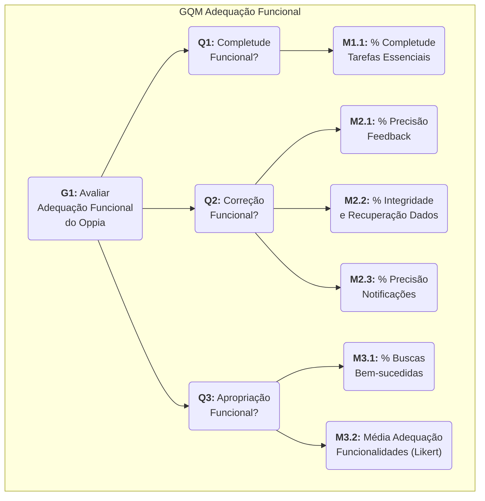

A Adequação Funcional é avaliada para garantir que o Oppia cumpra suas promessas como ferramenta de ensino, entregando as funcionalidades de forma completa, correta e apropriada aos seus objetivos. Esta página detalha o GQM para esta característica.

## 2.1 Objetivo de Medição de Adequação Funcional

<b>Tabela 1: Formalização do Objetivo de Medição (GQM) para Adequação Funcional</b>

<table>
<tr>
    <th>Dimensão</th>
    <th>Descrição</th>
</tr>
<tr>
    <td>Analisar a</td>
    <td>Plataforma Oppia (Interface Web e App Mobile).</td>
</tr>
<tr>
    <td>Com o propósito de</td>
    <td>Avaliar.</td>
</tr>
<tr>
    <td>Com respeito a</td>
    <td>Adequação Funcional</td>
</tr>
<tr>
    <td>Perspectiva de Avaliação</td>
    <td>Educadores (criadores de conteúdo) e Estudantes (usuários finais).</td>
</tr>
<tr>
    <td>Contexto</td>
    <td>Projeto acadêmico da disciplina de Qualidade de Software.</td>
</tr>
</table>

<b>Fonte: </b> Autoria de <a href="https://github.com/brunnoff">Bruno Fernandes</a> e <a href="https://github.com/bolzanMGB">Othavio Bolzan</a>

## 2.2 Diagrama GQM - Adequação Funcional

O diagrama abaixo ilustra a hierarquia do plano de medição para a característica de Adequação Funcional, desdobrando o objetivo principal nas questões que precisam ser respondidas e nas métricas que serão coletadas para respondê-las.

  
<strong>Figura 1:</strong> Diagrama GQM - Adequação Funcional

<b>Fonte: </b> Autoria de <a href="https://github.com/brunnoff">Brunno Fernandes</a> e <a href="https://github.com/bolzanMGB">Othavio Bolzan</a>

## 2.3 Questões e Métricas

Abaixo estão propostas questões relacionadas às subcaracterísticas de Adequação Funcional, cada uma acompanhada de métricas operacionais e fórmulas.

### Q1 — Completude Funcional

**Pergunta:** Em que medida o conjunto de funções da plataforma cobre todas as tarefas e objetivos especificados para os perfis de usuário?

**Métrica 1.1 — Percentual de Completude das Tarefas Essenciais**

  * **Fórmula:** % de completude = (Nº de tarefas essenciais concluídas com sucesso / Nº total de tarefas essenciais definidas nos requisitos) × 100.
  * **Hipótese de Aceitação:** 98% das tarefas essenciais (ex: criar lição, publicar, responder questão, ver progresso) devem ser concluídas sem impedimentos funcionais.
  * **Fonte (Diretriz):** Baseado em [Souza et al., 2008](#souza2008) para medição de completude de tarefas. A medição será feita por testes de cenário de uso executados pelos avaliadores.
  * **Fonte (Número da hipótese de aceitação):** Segundo uma pesquisa relatada no artigo [What Is A Good Task-Completion Rate?](#task-completion), qualquer valor aicma de 78% estaria acima da média, entretanto, para alcaçnar o quaritl superior seria preciso uma taxa acimad e 92%. Logo, decidimos adotar 98% como nossa hipótese de aceitação.

-----

### Q2 — Correção Funcional

**Pergunta:** Com que precisão as funções da plataforma produzem resultados corretos ou esperados, tanto em operação normal quanto em condições de falha?

**Métrica 2.1 — Taxa de Precisão do Feedback de Aprendizado**

  * **Fórmula:** % de precisão do feedback = (Nº de feedbacks correspondentes à resposta do aluno / Nº total de feedbacks avaliados) × 100.
  * **Hipótese de Aceitação:** 100% de precisão. O feedback é uma funcionalidade crítica para o objetivo de ensino da plataforma.
  * **Fonte (Diretriz):** [ISO/IEC 25010](#iso25010) (Correção). Medido por amostragem de testes funcionais em diferentes tipos de questões (múltipla escolha, texto, etc.).
  * **Fonte (Número da hipótese de aceitação):** Conforme a documentação do [Google Developers](#google) , 100% de precisão é a definição de um "modelo perfeito". Visto que o feedback de aprendizado (como a correção de testes) é uma funcionalidade determinística e crítica para o objetivo do software, qualquer taxa inferior a 100% seria inaceitável.

**Métrica 2.2 — Taxa de Integridade e Recuperação de Dados**

  * **Fórmula:** % de integridade = (Nº de testes de salvamento, recuperação e concorrência bem-sucedidos / Nº total de testes executados) × 100.
  * **Hipótese de Aceitação:** 99.5% de sucesso na preservação dos dados do usuário (progresso do aluno, rascunho do criador).
  * **Fonte (Diretriz):** [ISO/IEC 25010](#iso25010) (Correção). Medido via testes de estresse, concorrência (múltiplos editores) e interrupção (simulação de falha de rede ou fechamento do app).
  * **Fonte (Número da hipótese de aceitação):** Múltiplas fontes, como [dbt Labs](#dbt) e [SAP](#sap), citam "99.5%" como um benchmark padrão para confiabilidade (SLO - Service Level Objective) e níveis de desempenho operacional. Portanto, adotamos 99.5% como nossa

**Métrica 2.3 — Taxa de Precisão de Notificação**

  * **Fórmula:** % de precisão de notificações = (Nº de notificações entregues corretamente e no tempo esperado / Nº total de eventos que deveriam gerar notificações) × 100.
  * **Hipótese de Aceitação:** 95% de precisão e entrega dentro do tempo limite definido (ex: 5 minutos).
  * **Fonte (Diretriz):** [ISO/IEC 25010](#iso25010) (Correção). Medido por testes de integração de ponta a ponta (end-to-end) em cenários de submissão e atualização.
  * **Fonte (Número da hipótese de aceitação):** O [CleverTap](#clevertap), ao discutir métricas de notificação, utiliza 95% como exemplo de cálculo para uma taxa de entrega (delivery rate) bem-sucedida. Baseado nisso, definimos nossa hipótese em 95%.

-----

### Q3 — Apropriação Funcional

**Pergunta:** Em que grau as funções da plataforma facilitam a realização eficaz das tarefas e objetivos específicos de aprendizado e ensino?

**Métrica 3.1 — Eficiência na Recuperação de Informação**

  * **Fórmula (Quantitativa):** % de buscas bem-sucedidas = (Nº de buscas que retornaram resultados relevantes nos primeiros 5 resultados / Nº total de buscas executadas) × 100.
  * **Hipótese de Aceitação:** 85% de relevância nos 5 primeiros resultados para termos de busca comuns (ex: "matemática", "programação").
  * **Fonte (Diretriz):** [ISO/IEC 25010](#iso25010) (Apropriação). Medido por testes de usabilidade com usuários reais executando tarefas de busca predefinidas.
  * **Fonte (Número da hipótese de aceitação):** A fonte [Elastic](#elastic) explica a complexidade da relevância de busca (detalhando métricas como DCG) e esclarece que um número único não é um padrão de indústria. Nota: Embora o link fornecido não valide especificamente o número 85%, a hipótese é mantida como um alvo interno para eficiência.

**Métrica 3.2 — Avaliação da Adequação das Funcionalidades-Chave**

  * **Fórmula (Qualitativa):** Média da avaliação em escala Likert (1-5) da adequação das funcionalidades percebida pelos usuários.
  * **Hipótese de Aceitação:** Média de satisfação 4.0/5.0 nas funcionalidades de aprendizado (navegar, responder) e criação (editar, publicar).
  * **Fonte (Diretriz):** [Souza et al., 2008](#souza2008) (avaliação de adequação). Medido por questionários pós-uso aplicados aos perfis de estudante e educador.
  * **Fonte (Número da hipótese de aceitação):** Os benchmarks da indústria para satisfação do cliente, conforme [HelpCrunch](#helpcrunch), definem um bom desempenho como "mais de 4 de 5". Similarmente, [Userpilot](#userpilot) coloca a faixa "boa" de CSAT (Customer Satisfaction Score) em 65-80%. Sendo 4.0/5.0 equivalente a 80%, adotamos esta média como nossa hipótese.

-----

## Referências Bibliográficas

> <a id="souza2008" href="#anchor_1">1.</a> SOUZA, Fernando Mauro de et al. **Uso do GQM para Avaliar Documentos de Utilização de Framework**. Anais do III Workshop de Qualidade de Software. v. 1, p. 75-82, 2008.

> <a id="iso25010"  href="#anchor_2">2.</a>INTERNATIONAL ORGANIZATION FOR STANDARDIZATION. **ISO/IEC 25010:2011**. *Systems and software engineering — Systems and software Quality Requirements and Evaluation (SQuaRE) — System and software quality models*. Genebra: ISO, 2011.

> <a id="task-completion"  href="#anchor_3">3.</a>MEASURINGU. What Is A Good Task-Completion Rate?. MeasuringU. Disponível em: https://measuringu.com/task-completion/.

> <a id="dbt"  href="#anchor_4">4.</a>DBT LABS. Data SLAs: Best practices for data teams. dbt Blog. Disponível em: https://www.getdbt.com/blog/data-slas-best-practices.

> <a id="sap"  href="#anchor_5">5.</a>SAP. P&T Greyhound© Add-on for SAP® ERP (PNT Software & Consulting GmbH). SAP Store. Disponível em: https://www.sap.com/brazil/products/erp/partners/piccolinet-gmbh-pntgreyhound-addon.html.

> <a id="clevertap"  href="#anchor_6">6.</a>CLEVERTAP. Push Notification Metrics That Matter: CTR, Open Rate, and More. CleverTap Blog. Disponível em: https://clevertap.com/blog/push-notification-metrics-ctr-open-rate/.

> <a id="elastic"  href="#anchor_7">7.</a>ELASTIC. What is search relevance?. Elastic. Disponível em: https://www.elastic.co/what-is/search-relevance.

> <a id="helpcrunch"  href="#anchor_8">8.</a>HELPCRUNCH. Top 9 Customer Satisfaction Metrics to Measure (CSAT, NPS, CES). HelpCrunch Blog. Disponível em: https://helpcrunch.com/blog/customer-satisfaction-metrics/.

> <a id="user_pilot"  href="#anchor_9">9.</a>USERPILOT. Customer Satisfaction Benchmarking: What Is a Good CSAT Score?. Userpilot Blog. Disponível em: https://userpilot.com/blog/customer-satisfaction-benchmarking/.

-----

## Histórico de Versões

| Versão | Data       | Descrição                                                                                                       | Autor                                                     | Revisor                                                   |
| :----: | :--------- | :-------------------------------------------------------------------------------------------------------------- | :-------------------------------------------------------- | :-------------------------------------------------------- |
| `1.0`  | 14/10/2025 | Criação da estrutura inicial da página                                                                          | [Brunno Fernandes](https://github.com/brunnoff)           | [Bianca Patrocínio](https://github.com/BiancaPatrocinio7) |
| `1.1`  | 14/10/2025 | Adicionando tabela, questões e métricas                                                                         | [Bianca Patrocínio](https://github.com/BiancaPatrocinio7) | [Pedro Lucas Dourado](https://github.com/lucasdray)       |
| `2.0`  | 14/10/2025 | Adição de 3 novas questões (Q6-Q8)                                                                              | [Pedro Lucas Dourado](https://github.com/lucasdray)       | [Othavio Bolzan](https://github.com/bolzanMGB)            |
| `2.1`  | 14/10/2025 | Padronizando a documentação das métricas                                                                        | [Othavio Bolzan](https://github.com/bolzanMGB)            | [Brunno Fernandes](https://github.com/brunnoff)           |
| `3.0`  | 20/10/2025 | Refatoração GQM: generalização de questões, adição de hipóteses e diretrizes.                                   | [Bianca Patrocínio](https://github.com/BiancaPatrocinio7) | [Brunno Fernandes](https://github.com/brunnoff)           |
| `3.1`  | 24/10/2025 | Adição das fontes dos números de hipótese, revisão das perguntas deixando mais generalizadas e revisão do texto | [Pedro Lucas Dourado](https://github.com/lucasdray)       |  [Bianca Patrocínio](https://github.com/BiancaPatrocinio7)                                                         |
| `3.2`  | 25/10/2025 | Adição do diagrama de representação da hierarquia GQM | [Brunno Fernandes](https://github.com/brunnoff)        |  [Bianca Patrocínio](https://github.com/BiancaPatrocinio7)                                                         |

| `3.3`  | 17/11/2025 | Pequenos ajudes no Diagrama GQMAdição do diagrama de representação da hierarquia GQM | [Othavio Bolzan ](https://github.com/bolzanMGB) | |
