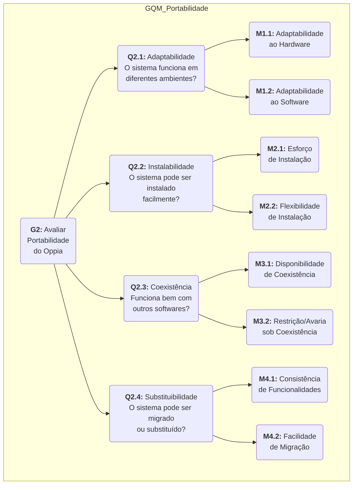

A Portabilidade é avaliada para verificar se o Oppia pode, de fato, chegar aonde mais se precisa dele, funcionando em diferentes ambientes.

## 3.1 Objetivo de Medição de Portabilidade

<b>Tabela 1: Formalização do Objetivo de Medição (GQM) para Portabilidade</b>

<table>
<tr>
    <th>Dimensão</th>
    <th>Descrição</th>
</tr>
<tr>
    <td>Analisar a</td>
    <td>Plataforma Oppia (Interface Web e App Mobile).</td>
</tr>
<tr>
    <td>Com o propósito de</td>
    <td>Avaliar.</td>
</tr>
<tr>
    <td>Com respeito a</td>
    <td>Portabilidade</td>
</tr>
<tr>
    <td>Perspectiva de Avaliação</td>
    <td>Educadores (criadores de conteúdo) e Estudantes (usuários finais).</td>
</tr>
<tr>
    <td>Contexto</td>
    <td>Projeto acadêmico da disciplina de Qualidade de Software.</td>
</tr>
</table>

<b>Fonte: </b> Autoria de <a href="https://github.com/brunnoff">Brunno Fernandes</a> e <a href="https://github.com/bolzanMGB">Othavio Bolzan</a>

## 3.2 Diagrama GQM - Portabilidade

O diagrama abaixo representa a estrutura GQM para a característica de Portabilidade. Ele mostra como o objetivo é decomposto nas questões, que por sua vez serão respondidas através da coleta das métricas.

  
<strong>Figura 1:</strong> Diagrama GQM - Portabilidade 

<b>Fonte: </b> Autoria de <a href="https://github.com/brunnoff">Bruno Fernandes</a> e <a href="https://github.com/bolzanMGB">Othavio Bolzan</a>

## 3.3 Questões e Métricas

Abaixo estão propostas questões relacionadas às subcaracterísticas de Portabilidade, cada uma acompanhada de métricas operacionais e fórmulas.

### Q1 — Adaptabilidade

**Pergunta:** O sistema adapta-se adequadamente a diferentes ambientes de hardware e software, mantendo suas funcionalidades essenciais?

**Hipótese:** Espera-se que o Oppia consiga operar corretamente em múltiplos ambientes de hardware e software, com pelo menos 70% de seus componentes funcionando de maneira adaptável.

**Métrica 1.1 — Adaptabilidade ao ambiente de hardware**

- **Fórmula:** X = A / B, onde
    - A = número de componentes que oferecem capacidade de executar em diferentes ambientes de hardware.
    - B = número de componentes que deveriam oferecer essa capacidade.

- **Nível de Aceitação:** 
    - ≥ 0,7 → Satisfatório
    - < 0,7 → Insatisfatório

- **Fonte:** GOMES FILHO, Marcílio José Albuquerque. **Um processo de avaliação da portabilidade de unidades de software.** Recife: Universidade Federal de Pernambuco, Centro de Informática, 2005. Disponível em: https://www.cin.ufpe.br/~tg/2004-2/mjagf.pdf
. Acesso em: 24 out. 2025.

**Métrica 1.2 — Adaptabilidade ao ambiente de software**

- **Fórmula:** X = A / B, onde
    - A = número de componentes que oferecem capacidade de execução em diferentes ambientes de software
    - B = número de componentes que deveriam oferecer essa capacidade

- **Nível de Aceitação:** 
    - ≥ 0,7 → Satisfatório
    - < 0,7 → Insatisfatório

- **Fonte:**  GOMES FILHO, Marcílio José Albuquerque. **Um processo de avaliação da portabilidade de unidades de software.** Recife: Universidade Federal de Pernambuco, Centro de Informática, 2005. Disponível em: https://www.cin.ufpe.br/~tg/2004-2/mjagf.pdf
. Acesso em: 24 out. 2025.

---

### Q2 — Instalabilidade

**Pergunta:** O sistema pode ser instalado e configurado com facilidade em diferentes plataformas, com mínimo esforço do usuário?

**Hipótese:** Espera-se que a instalação do Oppia seja concluída com sucesso na maioria dos ambientes suportados, e que o processo seja suficientemente flexível para permitir customizações necessárias.

**Métrica 2.1 — Esforço para instalar**

* **Fórmula:** X = A / B, onde
    - A = número de passos de instalação automáticos
    - B = total de passos de instalação necessários

* **Aceitação:** 
    - ≤ 0,4 → Satisfatório
    - 0,4 → Insatisfatório

- **Fonte:**  GOMES FILHO, Marcílio José Albuquerque. **Um processo de avaliação da portabilidade de unidades de software.** Recife: Universidade Federal de Pernambuco, Centro de Informática, 2005. Disponível em: https://www.cin.ufpe.br/~tg/2004-2/mjagf.pdf
. Acesso em: 24 out. 2025.

**Métrica 2.2 — Flexibilidade de instalação**

* **Fórmula:** X = A / B, onde
    - A = número de operações de instalação que admitem customização
    - B = número total de operações de instalação

* **Aceitação:** 
    - 0,2 ≤ X ≤ 0,4 → Satisfatório
    - X < 0,2 ou X > 0,4 → Insatisfatório

- **Fonte:**  GOMES FILHO, Marcílio José Albuquerque. **Um processo de avaliação da portabilidade de unidades de software.** Recife: Universidade Federal de Pernambuco, Centro de Informática, 2005. Disponível em: https://www.cin.ufpe.br/~tg/2004-2/mjagf.pdf
. Acesso em: 24 out. 2025.
---

### Q3 — Coexistência

**Pergunta:** O sistema mantém seu funcionamento correto quando compartilhando recursos com outros softwares ou aplicações no mesmo ambiente?

**Hipótese:** Espera-se que o Oppia consiga coexistir com outros softwares sem gerar conflitos ou erros frequentes, garantindo pelo menos 70% de disponibilidade em cenários compartilhados.

**Métrica 3.1 — Disponibilidade de coexistência**

* **Fórmula:** X = A / B, onde
    - A = número de produtos com os quais o software pode coexistir sem problemas
    - B = número total de produtos no ambiente de produção

* **Aceitação:** 
    - ≥ 0,7 → Satisfatório
    - < 0,7 → Insatisfatório

- **Fonte:**  GOMES FILHO, Marcílio José Albuquerque. **Um processo de avaliação da portabilidade de unidades de software.** Recife: Universidade Federal de Pernambuco, Centro de Informática, 2005. Disponível em: https://www.cin.ufpe.br/~tg/2004-2/mjagf.pdf
. Acesso em: 24 out. 2025.

**Métrica 3.2 — Coexistência apresentada**

* **Fórmula:** X = A / T, onde
    - A = número de restrições ou erros encontrados pelo usuário
    - T = tempo de uso compartilhado do software
    
- **Aceitação:**
    - ≤ 0,3 → Satisfatório
    - 0,3 → Insatisfatório

- **Fonte:**  GOMES FILHO, Marcílio José Albuquerque. **Um processo de avaliação da portabilidade de unidades de software.** Recife: Universidade Federal de Pernambuco, Centro de Informática, 2005. Disponível em: https://www.cin.ufpe.br/~tg/2004-2/mjagf.pdf
. Acesso em: 24 out. 2025.

---

### Q4 — Substituibilidade

**Pergunta:** É possível substituir ou migrar componentes do sistema sem impactar negativamente suas funcionalidades críticas?

**Hipótese:** Espera-se que a substituição de componentes do Oppia ou a migração de versões cause impacto mínimo nas funcionalidades, mantendo pelo menos 90% de consistência funcional com versões anteriores.

**Métrica 4.1 — Consistência de funcionalidades**

* **Fórmula:** X = A / B, onde
    - A = número de funcionalidades que produzem resultados semelhantes ao software antigo
    - B = número total de funcionalidades testadas

- **Aceitação:**
    - ≤ 0,9 → Satisfatório
    - 0,9 → Insatisfatório

- **Fonte:**  GOMES FILHO, Marcílio José Albuquerque. **Um processo de avaliação da portabilidade de unidades de software.** Recife: Universidade Federal de Pernambuco, Centro de Informática, 2005. Disponível em: https://www.cin.ufpe.br/~tg/2004-2/mjagf.pdf
. Acesso em: 24 out. 2025.

**Métrica 4.2 — Facilidade de migração**

* **Fórmula:** : X = A / B, onde
    - A = funcionalidades que produziram resultados satisfatórios
    - B = total de funcionalidades testadas.

- **Aceitação:**
    - ≤ 0,9 → Satisfatório
    - 0,9 → Insatisfatório

- **Fonte:**  GOMES FILHO, Marcílio José Albuquerque. **Um processo de avaliação da portabilidade de unidades de software.** Recife: Universidade Federal de Pernambuco, Centro de Informática, 2005. Disponível em: https://www.cin.ufpe.br/~tg/2004-2/mjagf.pdf
. Acesso em: 24 out. 2025.

---

## Referências Bibliográficas
>GOMES FILHO, Marcílio José Albuquerque.**Um processo de avaliação da portabilidade de unidades de software.** Recife: Universidade Federal de Pernambuco, Centro de Informática, 2005. Disponível em: https://www.cin.ufpe.br/~tg/2004-2/mjagf.pdf
. Acesso em: 24 out. 2025.

> SOUZA, Fernando Mauro de et al. **Uso do GQM para Avaliar Documentos de Utilização de Framework**. Anais do III Workshop de Qualidade de Software. v. 1, p. 75-82, 2008.

> INTERNATIONAL ORGANIZATION FOR STANDARDIZATION. **ISO/IEC 25010:2011**. *Systems and software engineering — Systems and software Quality Requirements and Evaluation (SQuaRE) — System and software quality models*. Genebra: ISO, 2011.

---

## Histórico de Versões

| Versão | Data       | Descrição                                           | Autor                                           | Revisor |
| :----: | ---------- | --------------------------------------------------- | ----------------------------------------------- | ------- |
|  `1.0` | 14/10/2025 | Criação da estrutura inicial da página              | [Brunno Fernandes](https://github.com/brunnoff) | [Bianca Patrocínio](https://github.com/BiancaPatrocinio7) |
|  `1.1` | 14/10/2025 | Adicionando tabela base      |  [Bianca Patrocínio](https://github.com/BiancaPatrocinio7)  |  [Othavio Bolzan](https://github.com/bolzanMGB)   |
|  `1.2` | 14/10/2025 | Adicionando métricas     |  [Othavio Bolzan](https://github.com/bolzanMGB)  |  [Douglas Marinho](https://github.com/M4RINH0)  |
|  `1.3` | 14/10/2025 | Reformulação das perguntas e métricas e adição das fontes dos valores    |  [Othavio Bolzan](https://github.com/bolzanMGB)  | [Brunno Fernandes](https://github.com/brunnoff)   |
| `1.4`  | 25/10/2025 | Adição do diagrama de representação da hierarquia GQM | [Brunno Fernandes](https://github.com/brunnoff)        |  [Othavio Bolzan](https://github.com/bolzanMGB)  |        
| `1.5`  | 17/11/2025 | Pequenos ajudes no Diagrama GQMAdição do diagrama de representação da hierarquia GQM | [Othavio Bolzan ](https://github.com/bolzanMGB) | [Brunno Fernandes](https://github.com/brunnoff) |