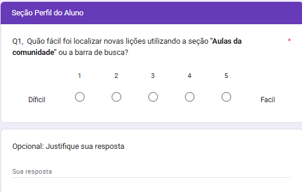
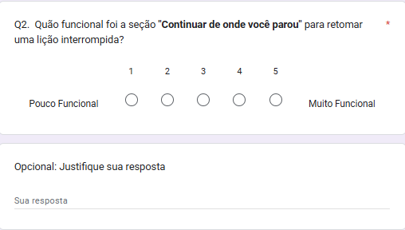
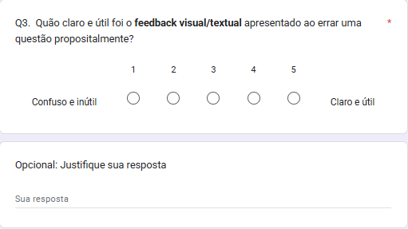
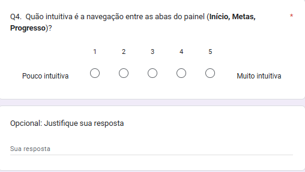
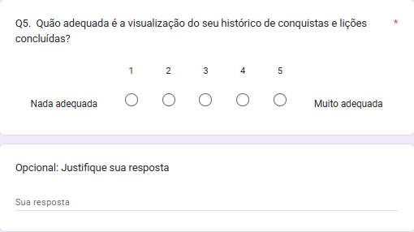

# 1. Evidências - Dados Brutos

Conforme o requisito de **Dados Auditáveis** do projeto, esta página centraliza os links para todos os dados brutos e a transcrição das respostas coletadas durante a Fase 4 de execução.

## 1.1. Planilhas de Execução de Testes

As planilhas abaixo contém registros da execução dos Casos de Teste definidos na Fase 3 para as duas características.

- [Pesquisa de Adequação Funcional](https://docs.google.com/spreadsheets/d/1oNSoMQMd6BHyyR3iGPCXwdvuum_agL9JjE7vBs2HurE/edit?usp=sharing)

- [Execução de Portabilidade](https://docs.google.com/spreadsheets/d/1miVE8ZLjBJ3Hz2Dc7lSG__37v82aBJ3x0twRZh6izQM/edit?usp=sharing)

## 1.2. Evidências de Execução (Gravações e Screenshots)

Os links abaixo contêm as evidências visuais (gravações de tela e capturas) coletadas durante os testes. Essas evidências foram utilizadas para documentar bugs e falhas de layout.

### Adequação Funcional

#### Entrevistas Perfil Educador (Métricas: 1.1, 2.2)

- [Entrevista 1 (Educador)](https://unbbr-my.sharepoint.com/:v:/g/personal/221008801_aluno_unb_br/IQBWL1MQQFvSTpvOcdxXG_ZFAVr4Aj8KsKEyS-jFOumTsDo?e=W5uT1b)
- [Entrevista 2 (Educador)](https://www.youtube.com/watch?v=56zzPi93ZdU)

#### Entrevistas Perfil Aluno (Métricas: 1.1, 2.1, 2.2, 3.1)

- [Entrevista 3 (Aluno)](https://unbbr-my.sharepoint.com/:v:/g/personal/221008801_aluno_unb_br/IQCf6K6KZbA8Tavnm3D0gJtnAepyjLU18tZZKNtQOxzCgZc?e=iqT3xn)
- [Entrevista 4 (Aluno)](https://unbbr-my.sharepoint.com/:v:/g/personal/221008801_aluno_unb_br/IQCzymiZhuZdSIdwapB683NJASb2K4i5Q5Q1EBF_7kzliEg?e=dDArh5)
- [Entrevista 5 (Aluno)](https://www.youtube.com/watch?v=ewq6tR4oBos)
- [Entrevista 6 (Aluno)](https://www.youtube.com/watch?v=5sVkO4PlK8k)

#### Formulário de resposta (Métrica 3.2)

- [Formulário Participante](https://docs.google.com/forms/d/e/1FAIpQLSetyawRJT7zX2NLicx83ApWIW-iLUTegw5gKIzv2LfroAOGCw/viewform?usp=dialog)
- [Planilha de Respostas (Aluno e Educador)](https://docs.google.com/spreadsheets/d/1oNSoMQMd6BHyyR3iGPCXwdvuum_agL9JjE7vBs2HurE/edit?gid=1221628895#gid=1221628895)

### Portabilidade

- [Pasta de Evidências - Portabilidade](https://unbbr-my.sharepoint.com/:f:/g/personal/231039150_aluno_unb_br/IgDlQ3YRPEVxTLxlzWkn0dzUAWGK3eFcp6eUemFDsH_qYN8?e=Qwxr2Q)

## 1.3. Transcrição dos Dados do Formulário
Abaixo se encontram figuras 01-12 que mostram o Termo de Consentimento Livre e Esclarecido (TCLE) e as perguntas que foram respondidas pelos participantes:

**Figura 01: Termo de Consentimento Livre e Esclarecido (TCLE)**

*Fonte: [Google Forms](https://docs.google.com/forms/d/1GbgZLmN1ttmyt0HVDu9yVx10GcUZZa6-Zcw-B77zYMc/edit)*

**Figura 02: Escolha de Perfil**

**Figura 03: Questão 1 - Perfil Aluno**

*Fonte: [Google Forms](https://docs.google.com/forms/d/1GbgZLmN1ttmyt0HVDu9yVx10GcUZZa6-Zcw-B77zYMc/edit)*

**Figura 04: Questão 2 - Perfil Aluno**

*Fonte: [Google Forms](https://docs.google.com/forms/d/1GbgZLmN1ttmyt0HVDu9yVx10GcUZZa6-Zcw-B77zYMc/edit)*

**Figura 05: Questão 3 - Perfil Aluno**

*Fonte: [Google Forms](https://docs.google.com/forms/d/1GbgZLmN1ttmyt0HVDu9yVx10GcUZZa6-Zcw-B77zYMc/edit)*

**Figura 06: Questão 4 - Perfil Aluno**

*Fonte: [Google Forms](https://docs.google.com/forms/d/1GbgZLmN1ttmyt0HVDu9yVx10GcUZZa6-Zcw-B77zYMc/edit)*

**Figura 07: Questão 5 - Perfil Aluno**

*Fonte: [Google Forms](https://docs.google.com/forms/d/1GbgZLmN1ttmyt0HVDu9yVx10GcUZZa6-Zcw-B77zYMc/edit)*

**Figura 08: Questão 1 - Perfil Educador**

*Fonte: [Google Forms](https://docs.google.com/forms/d/1GbgZLmN1ttmyt0HVDu9yVx10GcUZZa6-Zcw-B77zYMc/edit)*

**Figura 09: Questão 2 - Perfil Educador**

*Fonte: [Google Forms](https://docs.google.com/forms/d/1GbgZLmN1ttmyt0HVDu9yVx10GcUZZa6-Zcw-B77zYMc/edit)*

**Figura 10: Questão 3 - Perfil Educador**

*Fonte: [Google Forms](https://docs.google.com/forms/d/1GbgZLmN1ttmyt0HVDu9yVx10GcUZZa6-Zcw-B77zYMc/edit)*

**Figura 11: Questão 4 - Perfil Educador**

*Fonte: [Google Forms](https://docs.google.com/forms/d/1GbgZLmN1ttmyt0HVDu9yVx10GcUZZa6-Zcw-B77zYMc/edit)*

**Figura 12: Questão 5 - Perfil Educador**

*Fonte: [Google Forms](https://docs.google.com/forms/d/1GbgZLmN1ttmyt0HVDu9yVx10GcUZZa6-Zcw-B77zYMc/edit)*

Abaixo estão os dados brutos extraídos do formulário de avaliação aplicado aos participantes como parte do caso de teste CT-AF-08 (Avaliação Qualitativa) e que são mostradas nas figuras 01 - 12 acima. Estes dados alimentam a Métrica 3.2 (Média Adequação Funcionalidades) de Adequação Funcional.

### 1.3.1. Dados Brutos - Perfil Educador (Professor)

Perguntas focadas na experiência de criação e edição de lições.

* **Q1:** Criação (Modal Interaction)
* **Q2:** Fluxo (Add Response)
* **Q3:** Pré-visualização (Preview)
* **Q4:** Salvamento (Save Draft)
* **Q5:** Interface Híbrida (PT/EN)

| Data/Hora   | Q1  | Q2  | Q3  | Q4  | Q5  | Principais Comentários Qualitativos                                                                                                                      |
| :---------- | :-: | :-: | :-: | :-: | :-: | :------------------------------------------------------------------------------------------------------------------------------------------------------- |
| 23/11 11:27 |  5  |  4  |  5  |  5  |  2  | *"O fluxo é interativo, mas por estar em inglês não fica tao intuitivo"*; *"Na minha visão foi o unico ponto [Interface] que dificultou a usabilidade"*. |
| 23/11 21:03 |  4  |  1  |  5  |  5  |  1  | *"Me senti perdida... esperava que fosse adequado com a língua selecionada, uma vez que não sei bem o inglês"*.                                          |

---

### 1.3.2. Dados Brutos - Perfil Aprendiz (Aluno)

Perguntas focadas na experiência de busca, realização de lições e histórico.

* **Q6:** Busca (Aulas da Comunidade)
* **Q7:** Retomada (Continuar de onde parou)
* **Q8:** Feedback (Visual/Textual)
* **Q9:** Navegação (Abas Painel)
* **Q10:** Histórico (Conquistas)

| Data/Hora   | Q6  | Q7  | Q8  | Q9  | Q10 | Principais Comentários Qualitativos                                                                                                           |
| :---------- | :-: | :-: | :-: | :-: | :-: | :-------------------------------------------------------------------------------------------------------------------------------------------- |
| 23/11 11:58 |  4  |  5  |  5  |  2  |  -  | *"Não entendi muito bem o propósito da aba de metas e ela não pareceu funcionar corretamente"*.                                               |
| 23/11 21:10 |  2  |  4  |  4  |  3  |  4  | *"Não apareceram lições com o tema e o título esperado"*; *"Retornou com uma língua diferente da selecionada"*.                               |
| 23/11 21:34 |  5  |  5  |  5  |  5  |  3  | *"Eu achei que não seria recuperado, mas o sistema recuperou sim"*; *"Achei essa parte [Histórico] um pouco confusa"*.                        |
| 24/11 01:51 |  5  |  5  |  3  |  4  |  5  | *"A facilidade de encontrar o que se quer é crucial"*; *"Poderia investir em cores/animações para transformar o erro em uma parte positiva"*. |

---

## Histórico de Versões

| Versão |    Data    | Descrição                                                                           | Autor                                                     | Revisor                                                     |
| :----: | :--------: | :---------------------------------------------------------------------------------- | :-------------------------------------------------------- | :---------------------------------------------------------- |
| `1.0`  | 16/11/2025 | Criação da estrutura inicial da página                                              | [Brunno Fernandes](https://github.com/brunnoff)           | [Bianca Patrocínio](https://github.com/BiancaPatrocinio7)   |
| `1.1`  | 24/11/2025 | Adição das transcrições dos dados brutos e links das evidências                     | [Bianca Patrocínio](https://github.com/BiancaPatrocinio7) | [Othavio Bolzan](https://github.com/bolzanMGB)              |
| `1.1`  | 24/11/2025 | Adição das transcrições dos dados brutos e links das evidências                     | [Bianca Patrocínio](https://github.com/BiancaPatrocinio7) | [Pedro Lucas Dourado](https://github.com/pedrolucasdourado) |
| `1.2`  | 25/11/2025 | Estruturação da planilha de testes de portabilidade e adição do seu respectivo link | [Othavio Bolzan](https://github.com/bolzanMGB)            | [Brunno Fernandes](https://github.com/brunnoff)             |
| `1.3`  | 29/11/2025 | Correções nos textos de referência para as evidências coletadas                     | [Brunno Fernandes](https://github.com/brunnoff)           | [Pedro Lucas Dourado](https://github.com/pedrolucasdourado) |

